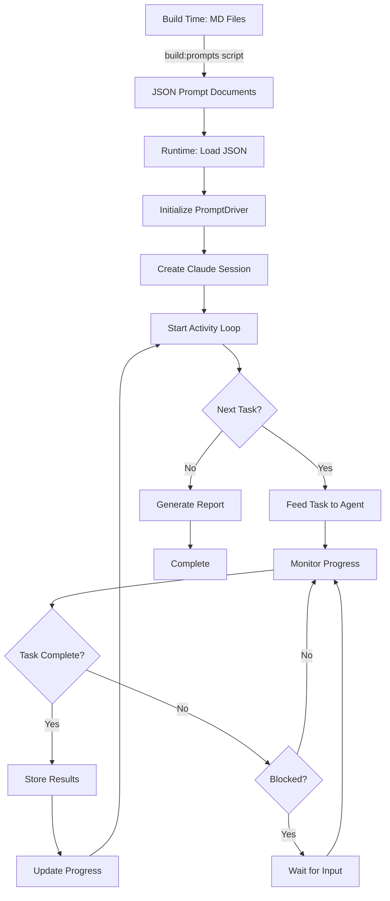

# Prompt Driver System - Implementation Plan

## Overview

A system to execute structured document modeling prompts sequentially through an agent activity loop. The system parses markdown instruction files, converts them to JSON during build time, and feeds them to agents task-by-task while maintaining continuous context.

## Architecture Components

### 1. Build-Time Prompt Processing

#### MD to JSON Converter (Build Step)
**Location**: `scripts/build-prompts.ts`
**Execution**: Run as part of the build process (npm script)
**Purpose**: Convert markdown instruction files to structured JSON without agent involvement

```typescript
// Structure for parsed prompts
interface PromptTask {
  id: string;           // e.g., "DM.00.1"
  title: string;        // e.g., "Ensure you have the required input and context"
  content: string;      // Full markdown content for the subtask (including any examples, restrictions, etc.)
}

interface PromptDocument {
  id: string;           // e.g., "DM.00"
  title: string;        // e.g., "Check the prerequisites for creating a document model"
  preamble?: string;    // Top-level notes/instructions before first subtask
  tasks: PromptTask[];
}
```

**Build Process**:
- Parse all MD files in `./prompts/` directory
- Extract level 1 headers (#) as main tasks
- Extract level 2 headers (##) as subtasks
- Include all content under each subtask (including ### headers) as raw markdown
- Output JSON files to `./dist/prompts/` or `./build/prompts/`
- Add to package.json scripts: `"build:prompts": "ts-node scripts/build-prompts.ts"`
- Include in main build: `"build": "pnpm build:prompts && tsc"`

**Dependencies**:
- remark or unified for markdown parsing
- fs-extra for file operations
- glob for file discovery

### 2. Prompt Driver Core

**Location**: `src/prompts/PromptDriver.ts`

```typescript
class PromptDriver {
  private currentSession: ClaudeSession;
  private progressTracker: ProgressTracker;
  private promptDoc: PromptDocument;
  
  // Load pre-built JSON prompt documents
  async loadPromptDocument(jsonPath: string): Promise<PromptDocument>
  
  // Execute entire prompt sequence
  async executePromptSequence(promptDocPath: string): Promise<ExecutionResult>
  
  // Execute individual task with completion detection
  async executeTask(task: PromptTask): Promise<TaskResult>
  
  // Wait for agent to complete current task
  async waitForCompletion(taskId: string): Promise<void>
  
  // Handle task blocking and stakeholder communication
  async handleBlockedState(reason: string): Promise<void>
}
```

### 3. Agent Activity Loop

**Location**: `src/prompts/AgentActivityLoop.ts`

```typescript
interface AgentActivityLoop {
  // State management
  currentTask: PromptTask | null;
  sessionContext: Map<string, any>;
  completedTasks: Set<string>;
  blockedTasks: Map<string, BlockedReason>;
  
  // Core loop methods
  async initialize(agent: AgentClaudeBrain): Promise<void>;
  async processNextTask(): Promise<void>;
  async feedTaskToAgent(task: PromptTask): Promise<void>;
  async monitorAgentProgress(): Promise<TaskStatus>;
  async handleTaskCompletion(result: TaskResult): Promise<void>;
  async handleTaskFailure(error: Error): Promise<void>;
  
  // Progress reporting
  async reportProgress(): Promise<ProgressReport>;
}
```

**Execution States**:
- `IDLE`: No task currently executing
- `EXECUTING`: Task sent to agent, awaiting completion
- `BLOCKED`: Waiting for stakeholder input
- `COMPLETED`: Task successfully completed
- `FAILED`: Task execution failed

### 4. Continuous Session Management

**Location**: `src/prompts/SessionManager.ts`

```typescript
class SessionManager {
  private claudeSession: ClaudeSDKSession;
  private contextStore: ContextStore;
  private checkpointManager: CheckpointManager;
  
  // Maintain single continuous session
  async createSession(): Promise<void>;
  async resumeSession(checkpointId: string): Promise<void>;
  
  // Context preservation between tasks
  async saveContext(taskId: string, data: any): Promise<void>;
  async getContext(taskId: string): Promise<any>;
  
  // Session health monitoring
  async healthCheck(): Promise<HealthStatus>;
  async handleDisconnect(): Promise<void>;
  async reconnect(): Promise<void>;
}
```

**Key Features**:
- Single continuous Claude session for entire prompt sequence
- Automatic context preservation between subtasks
- Session health monitoring with auto-reconnect
- Checkpoint/restore capabilities for long-running sequences

### 5. Implementation Modules

#### 5.1 Progress Tracker
**Location**: `src/prompts/ProgressTracker.ts`
- Track completion status of each task
- Generate progress reports for stakeholders
- Update WBS documents automatically
- Handle blocked state notifications

#### 5.2 Agent Integration Bridge
**Location**: `src/prompts/AgentIntegration.ts`
- Interface between PromptDriver and AgentClaudeBrain
- Format tasks for agent consumption
- Parse agent responses for completion signals
- Extract structured results from agent output

#### 5.3 Completion Detector
**Location**: `src/prompts/CompletionDetector.ts`
- Analyze agent output for task completion signals
- Validate completion criteria
- Detect blocked states and extract reasons
- Identify partial completions and failures

## Execution Flow



## File Structure

```
agent/
├── scripts/
│   └── build-prompts.ts         # Build-time MD to JSON converter
├── prompts/
│   ├── document-modeling/        # Source MD files
│   │   ├── 00.check-prerequisites.md
│   │   └── 01.write-description.md
│   └── [other-categories]/
├── build/
│   └── prompts/                  # Generated JSON files (gitignored)
│       ├── document-modeling/
│       │   ├── 00.check-prerequisites.json
│       │   └── 01.write-description.json
│       └── [other-categories]/
└── src/
    └── prompts/
        ├── PromptDriver.ts       # Main orchestrator
        ├── AgentActivityLoop.ts  # Core execution loop
        ├── SessionManager.ts     # Claude session management
        ├── ProgressTracker.ts    # Progress tracking
        ├── AgentIntegration.ts   # Agent bridge
        ├── CompletionDetector.ts # Completion detection
        └── types.ts              # Shared types
```

## Usage Example

```typescript
// During build
npm run build:prompts  // Converts all MD files to JSON

// At runtime
const driver = new PromptDriver();
await driver.initialize(agentBrain);

// Execute a complete document modeling sequence
const result = await driver.executePromptSequence(
  './build/prompts/document-modeling/00.check-prerequisites.json'
);

// The driver will:
// 1. Load the JSON prompt document
// 2. Create a continuous Claude session
// 3. Execute tasks sequentially (DM.00.1, DM.00.2, etc.)
// 4. Maintain context between tasks
// 5. Handle blocks and wait for stakeholder input
// 6. Track and report progress
// 7. Complete with final results
```

## Integration Points

- **AgentClaudeBrain**: Executes the actual tasks
- **ReactorPackagesManager**: Used in document modeling tasks
- **MCP Servers**: Provide tools during task execution
- **WBS Documents**: Progress tracking and goal management
- **Inbox System**: Stakeholder communication for blocked states

## Next Steps

1. ~~Implement the build-time MD to JSON converter script~~ ✅
   - Created `scripts/build-prompts.ts` with ID validation
   - Added `build:prompts` npm script
   - Generates JSON files in `build/prompts/`

1b. ~~Create PromptRepository for loading and managing prompts~~ ✅
   - Implemented `src/prompts/PromptRepository.ts`
   - Loads all JSON files from `build/prompts/`
   - Provides querying by category, ID, pattern
   - Includes metadata tracking and task retrieval
   - Full test coverage with actual file loading

2. Create the PromptDriver core orchestration logic
3. Build the AgentActivityLoop with state management
4. Implement continuous session management
5. Add progress tracking and reporting
6. Create completion detection logic
7. Test with existing document modeling prompts
8. Add support for other prompt categories